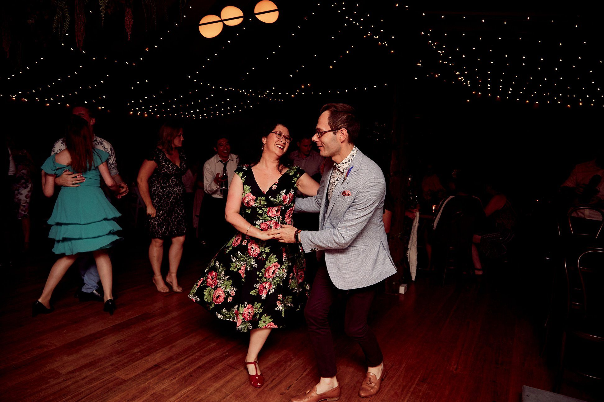

"The Spoonful" is excited to welcome special guest teachers (all the way from Sydney!) **Jo Yuen** and **Andy Firth**. Jo and Andy run Sydney's [Swing Patrol Juke Joint Blues](https://www.facebook.com/JukeJointBlues/) and have nurtured an amazingly inclusive scene in Sydney and beyond.

The evening will include TWO classes and social dancing with DJ Andy + DJ Royce.

- Open level classes from 7pm (descriptions below)
- Social dancing from 8.30pm
- Location: Lesser Hall, North Perth Town Hall
- When: October 5th.

[Register now](https://docs.google.com/forms/d/e/1FAIpQLScFQFqhmwHmgMwhVnfdZfFcRlX0cM4gxI6jS-dgN-3R93_ZEQ/viewform) for early bird prices. 2 classes for \$25.

## 7.00pm: Look Who’s Talking - Lead/Follow Voice & Musicality

Conversation is the fine art of connecting with your partner and sharing a moment through dance. This class will look at how to create a beautiful two-way conversation, and express your musicality.

We’ll look at how to work out where and when to use your voice, and explore how follows can add their ideas to the dance without disrupting the lead, and how leads can allow space for their follows to express their musicality. This concept of active vs open leading will open up a more fluid lead/follow dynamic, with more room for creativity and musicality for everyone!

## 7.45pm: Slipping and Sliding - Texas Shuffle Idiom

In recent years there’s been a lot more focus on idioms in Blues (idioms are sub-genres or localised dance styles that grew up in specific areas to particular types of music).

Texas Shuffle is one of the most popular Jukin’ idiom dances and is done to faster music, characterised by fabulously slidy, shuffly footwork and counterbalance connection. It’s a super fun way to dance to faster Blues music, and show off your fancy footwork and creativity with lots of room for individual styling.

Please make sure you bring your slipperiest shoes - leather soles are highly recommended or even wear your socks for maximum sliding!

Check out this video of Kelsey and Damon Stone doing Texas Shuffle!

`youtube: https://www.youtube.com/watch?v=h0wntUZhruw`

## About our guest teachers

Jo and Andy’s classes always aim to give you the tools to be a better dancer: technique to improve your connection; moves to increase your vocabulary; concepts to raise your creativity, and ways to inject your personality and create your own style.

### Jo Yuen

Way back in 2008 Jo went to her first dance class and has been hooked ever since! She quickly discovered Blues and was immediately drawn to the freedom of expression through movement, and connection with the music and her partner. As a follow, she really loves to explore follow voice and how it can contribute to a beautiful conversation.

In her teaching Jo really loves exploring connection and momentum in dance, and how you can bring your personality and creativity to the floor. Jo is always looking to “bring some sass” and a sense of fun and playfulness to everything she does.

### Andy Firth

Andy began his Blues dancing life shortly after learning Swing. What he discovered through the Blues was a whole new awareness of movement, expression, a deep connection to music, and a desire to learn more about the roots and culture that brought both the Blues and Jazz to life.

Having had the opportunity to study from amazing people both locally and abroad, Andy loves to share all he continues to learn. He loves exploring aesthetics, blues idioms and conversation in partnership while focusing on building respect and appreciation of Blues Culture. With Jo he has taught around Australia including at Borderline Blues and Swingtastic.

Andy is equally passionate about the music and is a regular DJ on the local circuit. He loves building on the mood of the room, blending songs which he hopes weigh on the soul and simultaneously lifts your spirits, allowing dancers to build a connection to the music and express themselves through the dance.

[Intrigued? Excited! Register now](https://docs.google.com/forms/d/e/1FAIpQLScFQFqhmwHmgMwhVnfdZfFcRlX0cM4gxI6jS-dgN-3R93_ZEQ/viewform)
